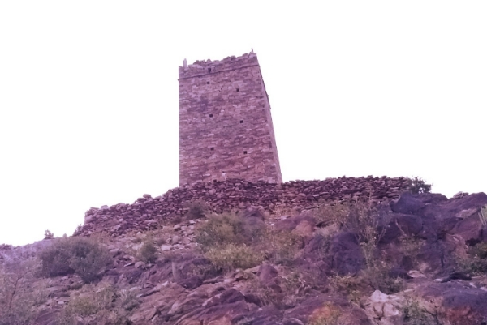

# موقع حصاحص الرسمي💯

مرحباً بك في موقع حصاحص الرسمي، المنصة المخصصة لتوثيق تاريخ ومعالم منطقة حصاحص الأثرية في يافع، اليمن.

---

### عن المؤسس

**الاسم:** هايل عيدروس محمد هرهره
**الدور:** مؤسس ومطور موقع حصاحص الرسمي.

---

### رؤية المشروع

يهدف هذا المشروع إلى جمع وتوثيق التراث الغني لمنطقة حصاحص، من خلال عرض:

* **المعالم التاريخية:** مثل "دار المشتل"، الذي يعود تاريخه إلى سلاطين آل هرهره.
* **المواقع الطبيعية:** الجبال والوديان الخلابة في المنطقة.
* **الفعاليات الاجتماعية:** توثيق العادات والتقاليد المحلية.
* **القصائد والأهازيج الشعبية:** الحفاظ على الموروث الثقافي غير المادي.

---

### المعالم الرئيسية

#### دار المشتل
برج حجري قديم يقع على قمة تل صخري، كان يستخدم كقصر للسلطان ونقطة مراقبة استراتيجية، ويعكس عراقة العمارة اليمنية الأصيلة.

---

### دعوة للمساهمة

هذا الموقع هو مشروع مجتمعي. نرحب بجميع المساهمات التي تثري المحتوى، سواء كانت صورًا قديمة، قصصًا، أو معلومات إضافية حول المنطقة.

### التواصل

* **الواتساب:** 780767543
* **البريد الإلكتروني:** (لا يوجد)

**© جميع الحقوق محفوظة لـ هايل هرهره 2025**
